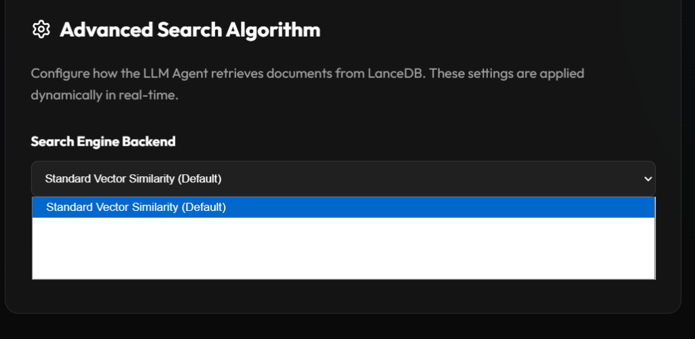

# OmniMind 🧠

OmniMind is a powerful local-first Retrieval-Augmented Generation (RAG) plugin built on top of [LM Studio](https://lmstudio.ai/). It acts as a bridge between your local LLMs and your personal knowledge base, seamlessly ingesting your **Obsidian Vault** and **Zotero Library** into a local vector database for instant, private semantic search and chat.

---

## 🎯 Why This Project Exists

While there are already several excellent MCP (Model Context Protocol) servers available for connecting to Obsidian, and robust integrations for Zotero, relying on them for local AI research presents a significant challenge: **Tool Overload**. 

Providing too many disparate tools or multiple MCP servers to smaller, local agents (especially models under 15B parameters) often leads to unreliable behavior, confusion in tool selection, and severe hallucinations. 

**OmniMind** was built to solve this by providing a single, highly-curated, and **unified toolset** specifically designed to help tiny models excel at academic and personal research. 

Additionally, OmniMind brings industry-best retrieval algorithms directly to local agents:
- **BM25 Search**: For exact keyword and author matching.
- **MMR (Maximal Marginal Relevance) Search**: To ensure diverse, non-redundant context retrieval.
- *Upcoming*: **Knowledge Graph Search**, leveraging Obsidian's native graph connections to traverse linked concepts.

---

## ✨ Features

*   **100% Local Privacy**: Everything—from your academic PDFs and personal notes to the embedding models and vector database—runs locally on your machine.
*   **Dual Ingestion Engine**:
    *   **Obsidian Sync**: Live-watches your Obsidian vault for modifications and instantly updates vector embeddings as you write.
    *   **Zotero Integration**: Scans your local Zotero SQLite database and processes the linked PDFs.
*   **Hybrid Vision OCR**: Employs an intelligent fallback system using local Vision Models. If a PDF lacks a proper text layer, OmniMind automatically parses the raw pages through a Vision LLM to extract high-fidelity text.
*   **Premium Web Control Panel**: Features a sleek background dashboard allowing you to monitor the ingestion queue, pause/resume tasks, retry failed jobs, and browse your extracted notes and papers.
*   **Lightning-Fast Search**: Instantly retrieve semantic matches from your entire personal database.
---

## 🚀 Getting Started

### 💡 Recommended Models (Quickstart)
To get the best performance out of OmniMind on a mid-range GPU (e.g., RTX 3060/4070 with 10-12 GB VRAM), we recommend loading the following models simultaneously in LM Studio (ensure "Keep multiple models in memory" is enabled):

1. **Embedding**: `lmstudio-community/embeddinggemma-300m-qat-GGUF` (Lightweight and highly accurate)
2. **Vision / OCR**: `ggml-org/DeepSeek-OCR-GGUF/DeepSeek-OCR-Q8_0.gguf` (~4 GB, fantastic for extracting raw text from scanned PDFs)
3. **Inference / Chat**:
   - **Ultra-Fast (Tiny)**: `ibm/granite-4-h-tiny` (~4 GB, fast reasoning for RAG synthesis)
   - **Highly Recommended (Advanced RAG)**: `google/gemma-4-12b-qat` (Released June 6, 2026. While this model natively supports 128k+ context windows, due to local VRAM limitations, it is highly recommended to configure it in LM Studio with a **16k - 24k context KV cache** to ensure it fits entirely inside VRAM for maximum speed).

### Prerequisites

1.  **LM Studio** installed and running.
2.  **Node.js** (v20+ recommended).
3.  Load an **Embedding Model** in LM Studio (e.g., `embeddinggemma-300m-qat-GGUF`).
4.  *(Optional)* Load a **Vision Model** in LM Studio if you have scanned PDFs that require OCR. Ensure "Keep multiple models in memory" is enabled.

### Installation

#### 📦 For Users (Recommended)
1. Visit **[https://lmstudio.ai/phuocnguyen90/omnimind](https://lmstudio.ai/phuocnguyen90/omnimind)**
2. Click **Run in LM Studio** to instantly install and load this plugin.
3. **No further setup required!** LM Studio will automatically handle fetching any backend requirements (like LanceDB) for your specific operating system.

#### 🛠️ For Developers
Want to modify the plugin from source, or build it yourself? 
Please see our [DEVELOPING.md](DEVELOPING.md) guide for instructions on setting up your local environment and running tests!

### Configuration

You can easily configure OmniMind directly inside the LM Studio Plugin UI. There is no need to manually edit `.env` files!

Ensure the following paths are set correctly for your system:
- **OBSIDIAN_VAULT_PATH**: e.g., `C:\Path\To\Your\Obsidian\Vault`
- **ZOTERO_DB_PATH**: e.g., `C:\Path\To\Your\Zotero\zotero.sqlite`
- **ZOTERO_STORAGE_PATH**: e.g., `C:\Path\To\Your\Zotero\storage`
- **MAX_CONCURRENT_WORKERS**: `4` (Recommended)

### Loading into LM Studio

1. Open LM Studio.
2. **Select your models**:
    * Embedding: `lmstudio-community/embeddinggemma-300m-qat-GGUF`
    * Vision/OCR: `ggml-org/DeepSeek-OCR-GGUF/DeepSeek-OCR-Q8_0.gguf`
    * Inference: `google/gemma-4-12b-qat` (Recommended, configured with 16k-24k context) or `ibm/granite-4-h-tiny`
3. **Enable Tools**: Open a Chat window. On the right sidebar, ensure **"Tools"** is toggled **ON** and the OmniMind tool is checked.
4. Send your first message! The ingestion engine will kick off automatically in the background.

---

## 🎛️ Control Panel

Once the plugin is running, navigate to:

**[http://localhost:4733](http://localhost:4733)**

The Control Panel provides a real-time dashboard to:
- Monitor **Pending**, **Processing**, and **Completed** ingestion tasks.
- **Pause/Resume** the queue to manage local CPU/GPU load.
- Browse the exact vector chunks that have been extracted and embedded into your LanceDB knowledge graph.

---

## 🧠 Best Practices & Local Model Quirks

When using local models (especially those under 30B parameters like `gpt-oss-20b` or `ibm/granite-4-h-tiny`) for Retrieval-Augmented Generation (RAG), you may encounter specific quirks. Understanding these will help you steer the agent effectively.

### 1. The "Helpfulness" Bias (Hallucinations)
Instruction-tuned models are heavily rewarded during training for being helpful. If you ask for a list of reading materials and the database only finds 1 or 2 matches, the model's neural weights will often "want" to give you a top-5 list. To satisfy this, it may invent (hallucinate) realistic-sounding reports or government agencies (e.g., inventing an "FTC AI Guidance" document).

**The Fix:** Use extremely strict, negative-constraint system prompts. 
*Recommended System Prompt Template:*
> *"You are an extraction assistant. Your job is to extract the names of books, papers, or authors based on the Zotero database or Obsidian notes that you have access via the tools. Do not mention any prior knowledge that does not explicitly appear from the search results of the tool."*

### 2. Pronoun Binding and Context Tracking
If you ask about "EU AI Policy" in Turn 1, and then in Turn 2 ask *"What is Floridi's take on this?"*, the LLM will strongly bind the word "this" to the exact topic of EU AI Policy. If it retrieves a broad paper by Floridi about general "Digital Governance," it may falsely claim the paper is irrelevant because it doesn't mention the EU explicitly.

**The Fix:** When you want the agent to synthesize broad concepts or make creative connections across texts, explicitly ask it to synthesize. Avoid ambiguous pronouns.
*Example:* > *"What is Floridi's take on the broader concept of AI governance, and how might his 2018 paper on 'Soft Ethics' apply to the EU policies we just discussed?"*

### 3. The "Tiny Model" Trap (False Negatives)
Extremely small models (e.g., `< 5B parameters`) struggle with strict negative constraints. If you give them the strict prompt above, they may become overly rigid. For example, if you ask for "US reading materials", and a chunk is titled "AI Index Report 2026" but the text mentions "California" and "Montana", the tiny model might fail to realize that California is in the US, and output: *"I could not find any US-specific materials."*

**The Fix:** If you experience false negatives (the database retrieves the document but the agent ignores it), you either need to loosen the prompt slightly or upgrade your inference model to a slightly larger class (e.g., `Llama-3-8B-Instruct` or `Qwen-2.5-7B`) for the final RAG generation step.

---

## 📝 License

MIT License. See `LICENSE` for more information.
