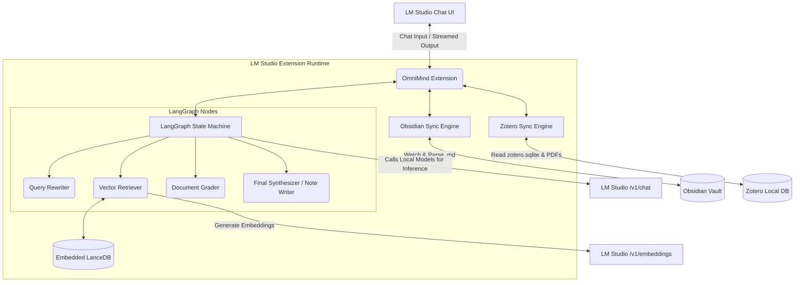

# Architecture & System Design

## 1. High-Level Architecture
The OmniMind plugin is designed as a standalone Node.js extension that runs inside the LM Studio runtime environment. It acts as an integration layer between the LM Studio chat interface, the local filesystem, and an embedded vector database. Crucially, it uses **LangGraph.js** to orchestrate structured, reliable agentic workflows.

## 2. Technical Stack

- **Runtime Engine:** Node.js (via LM Studio Extension Environment)
- **Plugin SDK:** `@lmstudio/sdk` (For registering the plugin and communicating with the chat UI)
- **Agent Orchestrator:** `@langchain/langgraph` (To construct deterministic state machines that make small local models perform reliably)
- **Database (Vector):** `@lancedb/lancedb` (Serverless, embedded vector store running inside the plugin directory)
- **Database (Relational):** `better-sqlite3` (For read-only queries against Zotero's `zotero.sqlite` database)
- **File System Watching:** `chokidar` (To provide real-time updates when the user modifies Obsidian notes)
- **Text Extraction:** `pdf-parse` (For extracting raw text from Zotero PDF attachments)

## 3. Core Components

### 3.1 Settings & Configuration Manager
Registers settings fields inside LM Studio for:
- `obsidian_vault_path`
- `zotero_db_path` (Path to the `zotero.sqlite` file)
- `zotero_storage_path` (Path to the Zotero PDF attachments directory)

### 3.2 Ingestion Engine
Responsible for digesting files into vector embeddings.
- **Obsidian Pipeline:** Parses Markdown files into paragraphs/sections. Extracts metadata (tags, links) and attaches them to the chunk's payload.
- **Zotero Pipeline:** Connects to SQLite in WAL mode. Extracts text and chunks it, appending the citation key as metadata.

### 3.3 Vector Store (LanceDB)
Stores records locally with the schema:
- `id`: string
- `vector`: Float32Array (768 dimensions)
- `source`: 'obsidian' | 'zotero'
- `path`: string (File path or citation key)
- `text`: string (The raw text of the chunk)
- `links_to`: string[] (Array of wikilinks found in this chunk, for graph awareness)

### 3.4 LangGraph Orchestrator
Replaces simple zero-shot tools with a structured graph. The graph maintains an internal `State` (e.g., `messages`, `retrieved_documents`, `current_query`).
1. **Query Rewriter Node:** Re-frames the user's prompt into an optimal search query.
2. **Retriever Node:** Queries LanceDB. Can also do direct lookups via `get_note_content` if a specific wikilink is requested.
3. **Grader Node:** Asks the local LLM "Are these documents relevant?". If no, loops back to rewrite the query.
4. **Synthesizer Node:** Takes the graded documents and generates the final response or writes the physical `.md` note to Obsidian.
